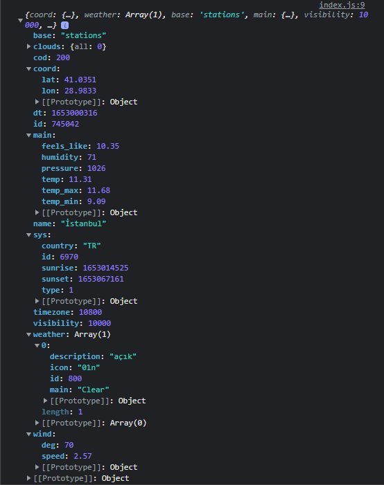

# JavaScript ile API üzerinden veri çekme örneği

öncelikle kendimize bir API endpoint'i belirleyelim. ben bu örnekte [OpenWeather](openweathermap.org)'ın Current weather data isimli endpoint'ini kullanıyorum, fakat siz başka örnek API'lar da kullanabilirsiniz

#### URL'imi tanımlıyorum.

Base URL'imi belirliyorum. Bu URL üzerinden hava durumunu çekeceğimden dolayı sürekli URL girmektense değişkene atayıp onu kullanmak daha basit olacaktır.

```javascript
const url = "https://api.openweathermap.org/data/2.5/"
```
bu şekilde url'imi tanımlıyorum. daha sonra bize lazım olacak.

#### API Key'imi tanımlıyorum.

openweathermap.org'un bana sağladığı API anahtarımı belirledim. Bunu da veri çekerken kullanacağım, dolayısıyla bunu da bir değişkenin içine almak daha sağlıklı bir kullanım şekli olacaktır.

```javascript
const key = "79271e85b3970cad9d0895e10a5dd83c"
```
bu şelilde de key'imi tanımlıyorum. unutmayın, birden fazla kullanma olasılığınız olan her şeyi değişken içine yerleştirmek mantıklı olacaktır. doğru isimlendirmeler de bize bu konuda yardımcı olacaktır.

#### Sorgumu hazırlıyorum.

query'mi yani sorgumu hazırlıyorum. dediğim gibi değişkenleri kullanmak bana kolaylık sağlıyor, string verilerimizi  <code>\`\`</code> işaretleri arasında yazarsak, aşağıdaki gibi javascript komutlarını `${ }` içerisinde belirtebiliyoruz ve bu hem dinamiklik katıyor hem de fazladan yazı yazmamamıza olanak sağlıyor.

```javascript
var query = `${url}weather?q=istanbul&appid=${key}&units=metric&lang=tr`;
```
gördüğünüz gibi bu şekilde bir tanımlama yapmak daha anlaşılır ve basit.

#### Sorgumu başlatıyorum

JavaScript'in bize sağladığı ```fetch``` modülünü kullanarak basitçe web servislerine istek yollayabilir ve döndürdükleri değeri alabilirsiniz. ```fetch``` komutu bize bir **Promise** döndürür. Promise'in ne olduğunu basitçe anlatmak gerekirse, ne zaman biteceği sizin tarafınızdan bilinmeyen, beklemeniz gerekebilen işlemler için kullanılan bir JavaScript modülü. Durum çözüldüğünde yani ```resolved``` olduğunda, dönen değeri ```.then()``` ile yakalıyoruz, reddedildiğinde yani ```rejected``` olduğunda ise hatalarımızı ```.catch()``` ile yakalıyoruz.

```javascript
fetch(query)
    .then(res => res.json())
```
daha önceden oluşturmuş olduğum query'mi fetch ediyorum ve then ile dönecek olan değeri json formatına çeviriyorum. ben burda kolaylık olsun diye arrow functionları kullandım fakat bu yapıyı aşağıdaki şekilde de kurabilirdik;

```javascript
fetch(query)
    .then(function(res){
        return res.json()
    })
```

evet bu işlemle dönen datamızı json formatına dönüştürebildik. Promise'lerde chaining işlemi yapabiliyoruz, dolayısıyla ben tekrar then komutunu çalıştırabilirim ve istediğim kadar da bunu sürdürebilirim. buradan sonra tek bir kez çalıştıracağım ve bunu da datamızı konsola yazdırmak için kullanacağız, hemen bakalım;

```javascript
    .then(res => {
        console.log(res);
    })
```
evet burada da tekrar arrow function kullandım, siz yukarıda gösterdiğim gibi function ibaresiyle de konsola yazdırabilirsiniz, -bu sefer return kullanmamak kaydıyla- eğer her şeyimiz doğruysa tarayıcımızda refresh ettiğimizde konsolumuzda aşağıdaki gibi bir çıktı olması gerek;

